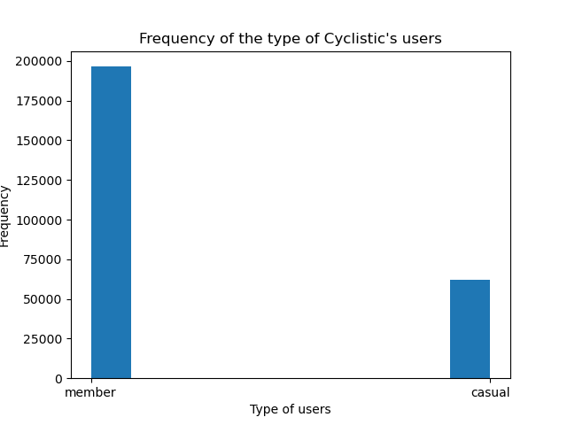
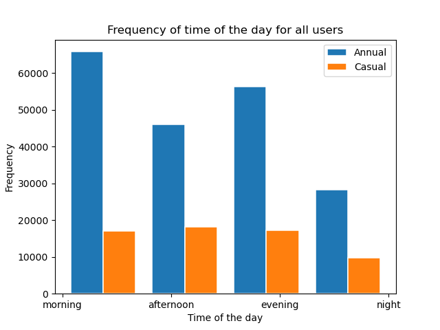
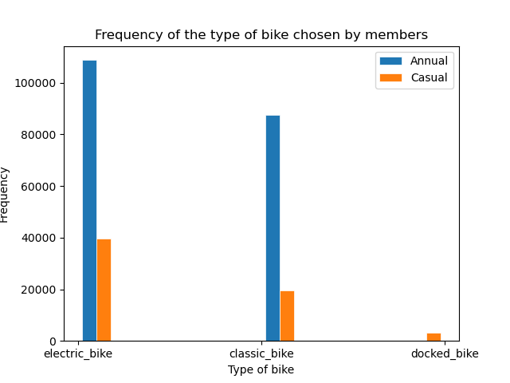
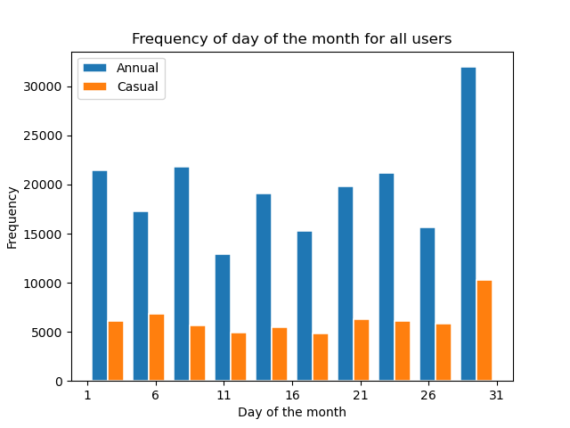
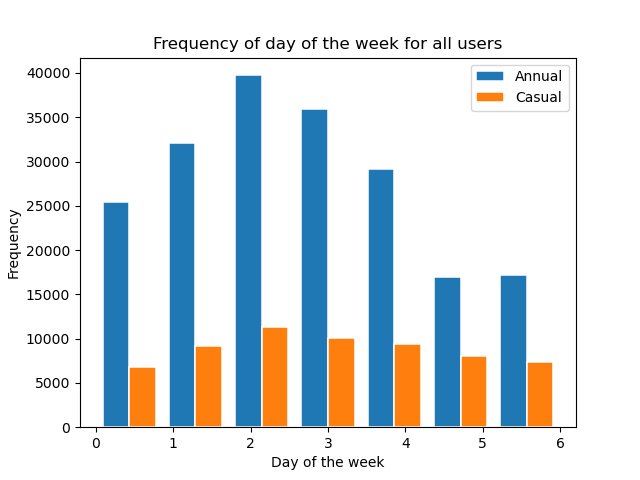
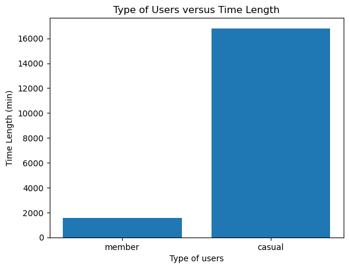
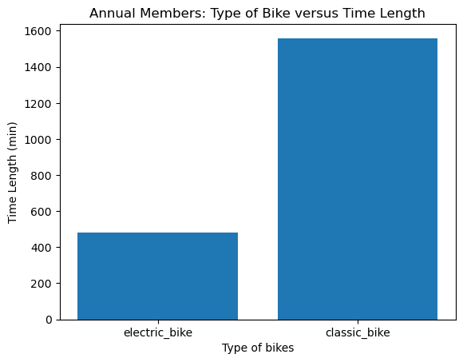
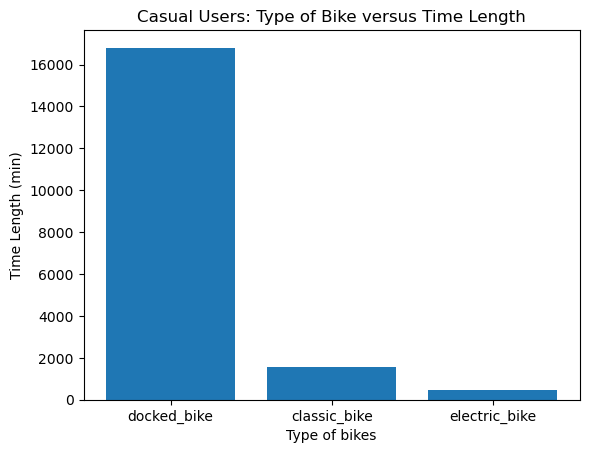
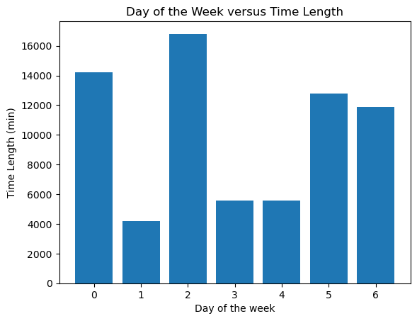
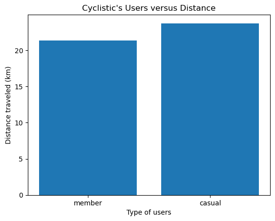

# **Study Case: Cyclistic** 🚲📖 

This is the report for the data analysis project, a company named Cyclistic.

***Company's description:*** *Cyclistic is a bike-share company in Chicago that'd like to grow its success through maximizing the number of annual memberships.*

As part of Cyclistic's marketing strategy they created flexible pricing plans:
 - single-ride passes
 - full-day passes
 - annual memberships  

Customers who purchase single-ride or full-day passes are referred to as **casual riders**. Customers who purchase annual memberships are **Cyclistic members**.

# **Business task** 💼
### What we're trying to solve is the following Cyclistic's goal: ***Design marketing strategies aimed at converting casual riders into annual members.***
 
 * The marketing analyst team needs to better understand how annual members and casual riders differ, why
 casual riders would buy a membership, and how digital media could affect their marketing tactics. The manager and their team are interested in analyzing the Cyclistic historical bike trip data to identify trends.

# **1. ASK**
What we're trying to solve is that we want Cyclistic to become more successful by making casual riders more interested in becoming annual members.
* How do annual members and casual riders use Cyclistic bikes diferently?

# **2. PREPARE**
## Data sources 🗂
The data selected is from March 2023 available at: https://divvy-tripdata.s3.amazonaws.com/index.html
In which the trip data such as; started_at, ended_at, start_station_id, end_station_id, geolocation, among others is registered in an Excel file.

The data seems reliable in a way that values make sense and that, generally, it is consistent in each column of data registered. The data is also very recent at the moment of writing this and the information registered in the file is easy to understand.

To make sure the data is going to be ready to analyze, a data cleaning process will be done.

To work on this project the following tools are used:
* Jupyter Notebook
* Anaconda: Visual Studio
* Python version: 3.9.13
* Python libraries that will be installed as the Data Analysis progresses
* Git/GitHub to save the project remotely

# **3. PROCESS**
## Data manipulation 📚

For this step, the following Python libraries were used (in that order) to accomplish further analysis of the data:          
    ✔ Pandas   
    ✔ Datetime  
    ✔ GeoPy        
    ✔ Matplotlib         
    ✔ NumPy    

### 🌟**Organizing data**
The data provided was examined initially by checking general statistics and size of the dataframe. The Cyclistic's dataframe provided was found to have 258678 rows and 13 columns in total.

The dataframe columns were studied to determine if all of them are going to be useful in the data analysis process or not. 

The type of data for each column was printed in the code in order to make sure that the information in them made sense for all of them. 

In the cases where the data type was not correct then type casting was excuted to assign the correct type to that column, which was the case of the time columns, such as; started_at, ended_at. Finally, the format of the datetime columns was revised to see what math operations can be executed and what insights are possible to get from this data.

Two aditional columns were created for further analysis using the information in the original dataframe: 
- The column 'time_of_day' to know what time of the day the users used Cyclistic's service most often.
- The column 'day_of_week' to know what day of the week is more frequent by customers.
- The column 'day_of_month' to find how frequent the customers are during the month.

These three columns were obtained using the 'started_at' column.

Other features from the dataframe were identified:
- The column 'rideable_type' has 3 different types of bikes: electric, classic and docked.
- The column 'member_casual' has 2 different types of users: annual members and casual members.
- The type of user most registered in the dataframe is: annual members with a ~76% from the total (casual members with ~24%).

### 🌟**Data cleaning**
Most of the data was good in terms of consistency. The presence of other special characters in the data, was not the case for this dataframe, as in the previous step we verified that the data type was consistent for all the columns. 

The presence of duplicated data was revised and later on, the columns with data that were not considered relevant for the analysis such as the location (station names), were removed. 

The NaN values, these were checked in the dataframe, having found only 183 of these in two columns that are going to be considered in the analysis: ending latitude and ending longitude. For these existing NaN, it was decided to keep them all since these were considered a very small percentage (0.07%) out of the total data available, so it was best to keep them and assign them their respective mean value instead.

* Further data manipulation included as well calculating the time length of each customer ride registered. The difference between the columns 'started_at' and 'ended_at' was transformed in seconds and then, to the same units, minutes. 
* GeoPy a Python library was installed and imported to obtained the distance for each ride in order to study it further along the data analysis. This was possible thanks to the longitude and latitude values present in the data frame, using 'geopy.distance.geodesic'.
* Columns that were no longer going to be used after doing any of the previous processes mentioned were dropped, and new columns with the latest results were created.

# **4. ANALYZE**
## Analysis summary 🤓
The analysis began with a data study as detailed as possible, through the statistics after any transformations and the plots by the end of the Jupyter Notebook. 
* First, the categorical data was identified. Columns: rideable_type and member_casual. The stations names, after taking a look at the information there, it was explicit that there was no pattern for these names, as these vary a lot and are different points within the city, so these were not considered and dropped from the dataframe.
* The amount of unique values of the categorical data was:
    - For the rideable_type column: electric_bike ➡ 148575, classic_bike ➡ 107083, and docked_bike ➡ 3020
    - For the member_casual column: member ➡ 196477 (~76%), and casual ➡ 62201 (~24%)
* No duplicated data was found.
* Two columns were not in the correct data type: 'started at' and 'ended at'. These were changed to the correct datetime type.
* NaN values were checked in the dataframe for the columns end_lat and end_lng, these NaN values were replaced by the mean of each column.

Comparisons were made through statistics of features. The results are as follows:

### **4.1. Comparing between type of customers versus time length**
* On average, customers have a traveled time of:
    - Casual users = 21m 24.74s 
    - Annual members = 09m 46.51s
### **4.2. Comparing between type of bikes versus time length**
* On average, the traveled time length for each bike is:
    - Electric bikes = 09m 46.51s
    - Classic bikes = 14m 18.06s
    - Docked bikes = 02h 12m 22.62s
### **4.3. Comparing between type of customers versus time of the day**
* The most frequent time of the day where customers used Cyclistic:
    - Casual users = Afternoon 
    - Annual members = Morning
### **4.4. Comparing between type of bikes versus time of the day**
* The most frequent time of the day where the different types of bike were used:
    - Electric bikes = Morning
    - Classic bikes = Morning
    - Docked bikes = Afternoon
### **4.5. Comparing between type of customers versus day of the week**
Here, 0 is Monday and 6 is Sunday
* On average, the day of the week where each bike is more frequent to be used by customers is:
    - Casual users = 2.96   (Wednesday~Thursday)
    - Annual members = 2.97 (Wednesday~Thursday)
### **4.6. Comparing between type of bikes versus day of the week**
Here, 0 is Monday and 6 is Sunday
* On average, the day of the week where each bike is more frequent to be used by customers is:
    - Electric bikes = 2.75 (Wednesday~Thursday)
    - Classic bikes = 2.71  (Wednesday~Thursday)
    - Docked bikes = 3.17   (Thursday)
### **4.7. Comparing between type of customers versus day of the month**
* On average, the day of the month where each bike is more frequent to be used by customers is:
    - Casual users = 16.45   (By the middle of the month, 3rd week)
    - Annual members = 16.31 (By the middle of the month, 3rd week)
### **4.8. Comparing between type of bikes versus day of the month**
* On average, the day of the month where each bike is more frequent to be used by customers is:
    - Electric bikes = 16.55 (By the middle of the month, 3rd week)
    - Classic bikes = 16.04  (By the middle of the month, 3rd week)
    - Docked bikes = 16.73   (By the middle of the month, 3rd week)            
### **4.9. Comparing between type of customers versus distance traveled**
* On average, customer have a distance traveled of:
    - Casual users = 1.78km
    - Annual members = 1.85km
### **4.10. Comparing between type of bikes versus distance traveled**
* On average, the distance traveled length for each bike is:
    - Electric bikes = 1.92km
    - Classic bikes = 1.71km
    - Docked bikes = 2km

At this point, we can tell a difference already between the type of customers and the types of bikes which is the main element in Cyclistic's service. Besides that, we have now more idea about the customers' preferences and needs when it comes to use Cyclistic, being that, analyzing other features such as the day of the week, month, and time of the day. All of these discoveries will be relevant to stablish the differences that can help casual users improve their experience in Cyclistic by becoming annual members.

# **5. SHARE**
For this data, histograms and bar graphs were chosen as the type of plots that will represent the results, due to the fact that we have categorical features and is easier to make comparisons between features with this type of plot. 

## Key findings 📊🔍

* **To consider: The amount of the data registered in the dataframe for annual members is greater than for the casual riders, which is 76% and 24% repectively.**

* Annual members take their trips either in the morning or afternoon more frequently. Casual riders tend to mantain the usage of Cyclistic's service in the morning, afternoon and evening pretty much evenly.

* The electric bike is the most used out of the 3 possible types offered. Docked bike has only been used by casual riders.

* The last day of the month, on average, has a higher frequency for both type of customers. For the other days of the month it mantains a constant behaviour with some peaks by the beginning of the month. 
In general, however, we can tell that the usage remains constant, except for the last day of the month.

* We can see that the peak day is around the middle of the week, wednesday. Thursday is also very close to the highest peak, for both, annual members and casual.  

* Both type of customers travel a distance of ~2km or less.

* Annual members have a shorter traveled time compared to the casual members.

* For the trips registered for the annual members, the time length for electric bikes was 8hrs in total, whilst classic bikes took around 26hrs. That is, a ratio of 3.25 times.

* For the trips registered for the casual customers, the time length for docked bikes was 280hrs in total, whilst classic bikes took around 26hrs and electric bikes 8hrs.

* Mondays and wednesdays are the days in which riders may take more time to transport. We can clearly see this happening for saturdays and sundays as well.

* The distance traveled by all customers is nearly the same.

* Casual users spend more time in their bike trips (~275hrs) and annual users spend less time (~31hrs). That is, annual users spend less time in their transportation compared to casulal users by a ratio of ~9 times.

# **6. ACT**

So...how do annual members and casual riders use Cyclistic bikes diferently? We'll review some differences in the following conclusions.

## Conclusions ✏
**✔**  From the frequency seen for the features day of the week and day of the month, we can see a higher frequency by the middle of the month and middle of the week. That is, that people in general, may have a tendency of using the service during business days more often and we can infere that this may be with the purpose of some work/responsibilities related duties.    

**✔**  Mornings and evenings are the times of the day where the customers use the service the most. This makes sense since generally, people tend to have a work schedule from 9 to 5. 

**✔**  The docked bike takes longer than the classic bikes. Being the electric bike the fastest by 3 times compared to classic bikes, and most preferred by all customers with a mean of 9 minutes of time length in their trips. Making the electric bike quite ideal for transportation to workplaces and the most preferred by both type of customers. The next preferred is the classic bike, especially by the annual members.  

**✔**  The docked bike takes longer time length in their trips, we could say this is the slowest option out of the 3 available.    

**✔**  We also found that casual users tend to use the service in the afternoon. Docked bikes were found to be only used by casual users and plus, docked bikes are mostly use in the afternoon as well so, we can say that casual users may tend to use the service for hanging out every now and then more frequently compared to annual members. Why?:  
* If they're not in a hurry, naturally, they would choose the docked or classic bike. On the contrary, if that's not the case, you'd choose the electric bike most likely (because you don't want to get too sweaty for work, an appointment... or date? Do you?👀).   
* The use frequency of the service is more constantly maintained throughout the week compared to annual members that have a more pronounced peak by the middle of the week, so casual users may use this service for -precisely- more casual occasions.   
* As found in the previous data analysis, casual users tend to have more time consuming trips. Casual users' highest frequency peak is by the middle of the week with a value of around 11000 and even tends to mantain the use of the service in the weekend with a frequency value of ~7000 to ~8000, so compared to that, there is no big gap as there is in the annual members' graph where the peak at nearly 40000 drops to nearly 17000, diminishing by a little over 50%.  

**✔**  All customers have pretty much the same traveled distance, however, the time they spent in their trips is significantly different. We saw, that the majority of them prefered electric bikes, however, annual members don't use docked bikes. Meanwhile, casual users do use the docked bike. This being the only difference between them , we can see that this preference impact greatly in the results.
For this reason, 

## Next Steps
My top three recommendations:
⏩   
⏩   
⏩   

***What else could we consider for a deeper analysis?***
* We saw in the beginning of the analysis that there is way more data available for annual members than casual. It'd be ideal to have at least an even amount of information to consider from both types and get to know more the behaviour/tendencies from both.
* Pricing information: We don't know exactly what the customers are paying for the service. Does the bike type influence on the price of the service? Does the time of the day change the price? If a customer use the service by night, is it cheaper, more expensive, or the same?  Of course customers look for an opportunity to have a quality service for a good price, so it'd be a good idea to know more information about it to propose more decisions that can call their attention from casual user and the public.
* Condition information: Is there any limited use for the customers? Distance limitation? Time limitation?
* Benefit information: What is the added value that annual users get? What is the difference between the benefits that customers get?
